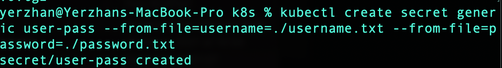
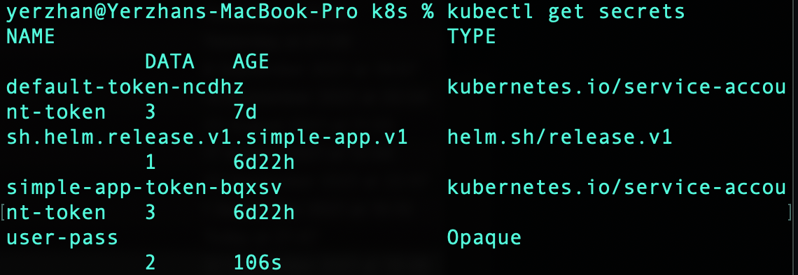
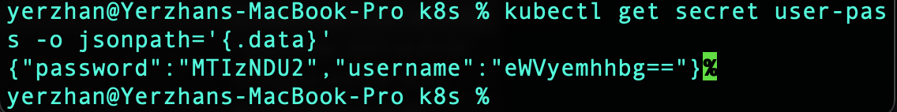
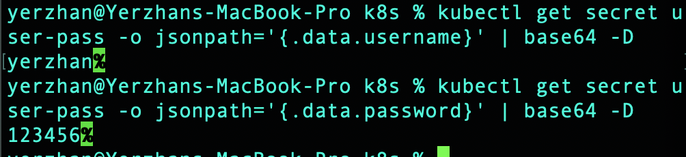
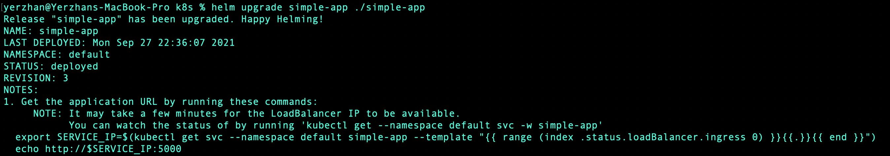
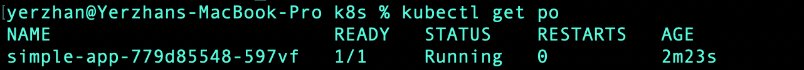
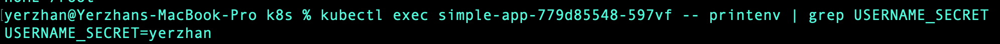
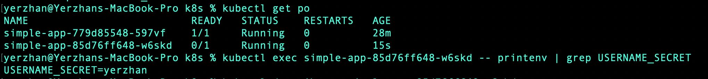

# Lab11
- Creating secret
  
- Listing secrets
  
- decoding secrets
  
  
- Creating secret by using helm
After changing helm secret related files we need to upgrade it
  
- Get pods
  
- Checking secret inside pod
  
- Set up requests and limits 
```
resources:
   limits:
     cpu: 100m
     memory: 128Mi
   requests:
     cpu: 100m
     memory: 128Mi
```
After set up, we need to upgrade helm and check. Everything works properly
